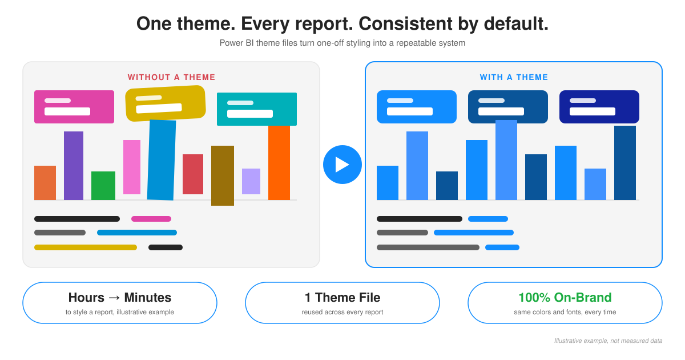

# PowerBI Theme Development

This repository holds a growing collection of Power BI report themes, plus the
tooling used to design, test, and iterate on them faster.

## What's in here

| Path | Description |
|---|---|
| `src/*.json` | Individual Power BI theme JSON files (e.g. `Fluent2-CY26SU03.json`, `Theme_ZK.json`, `Sample template.json`). Each one is a standalone theme you can apply to any Power BI report via **View → Themes → Browse for themes**. |
| `src/Current report theme schema.json` | The official Power BI report-theme JSON schema, used for validating theme files against Microsoft's spec. |
| `src/Theme checker/` | A self-contained Power BI Project (PBIP) used as a visual test bench for themes — see below. |
| `docs/` | An [MkDocs](https://www.mkdocs.org/) documentation site with design notes and before/after screenshots. |

## Testing a theme

`src/Theme checker/Theme checker.pbip` is a sample report (backed by the
Contoso 10K dataset) built to exercise nearly every native Power BI visual
type — bar/line/pie/waterfall/funnel/scatter charts, gauges, KPIs, cards,
tables, slicers, buttons, navigators, decomposition tree, AI narratives, and
more — spread across dedicated pages, so you can see exactly how a theme
affects every visual at a glance.

To try a theme out:

1. Open `Theme checker.pbip` in Power BI Desktop.
2. Apply a candidate theme from `src/*.json` via **View → Themes → Browse for
   themes**.
3. Click through the report pages and check colors, fonts, and spacing
   render as expected across all visual types.

## Documentation

For deeper design notes and before/after comparisons, see the
[documentation site](docs/index.md).

## License

No license has been set for this repository yet — until one is added here,
please check with the repo owner before reusing these theme files.

<video src="docs/assets/Table%20Transition.mp4" autoplay loop muted></video>