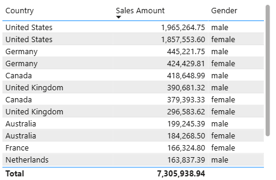
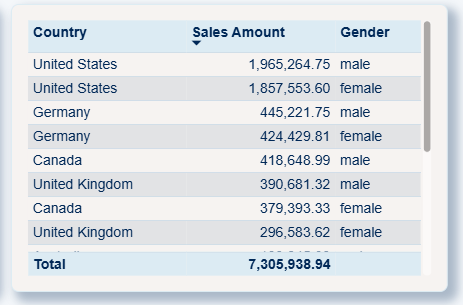

# Power BI Theme Development

This project explores how to build clear, consistent, professional Power BI themes — practical templates and guidance for turning report styling from a repeated chore into a one-time setup.

## What you'll find here

- theme examples and templates
- guidance for building and refining report styling
- practical notes on consistency, accessibility, and design quality

<video src="assets/Table%20Transition.mp4" autoplay loop muted></video>

## Why should I care?

Stop rebuilding the same visual polish on every report. A reusable Power BI theme turns hours of manual styling into minutes — one setup, applied everywhere.

**What you get:**
- **Speed:** Apply consistent, on-brand styling in minutes instead of rebuilding it report by report
- **Consistency:** Every dashboard looks like it came from the same team, not five different ones
- **Credibility:** A polished, on-brand report reads as more trustworthy to stakeholders — same data, stronger impression

The more reports you build, the bigger the payoff. One theme, reused across a portfolio, compounds the time saved every time — see the before/after difference below.

